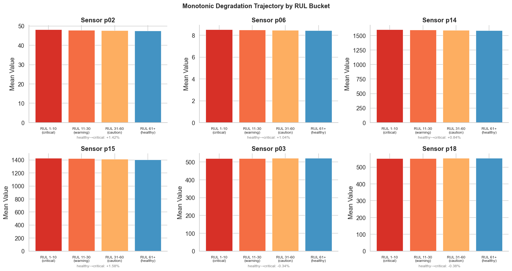
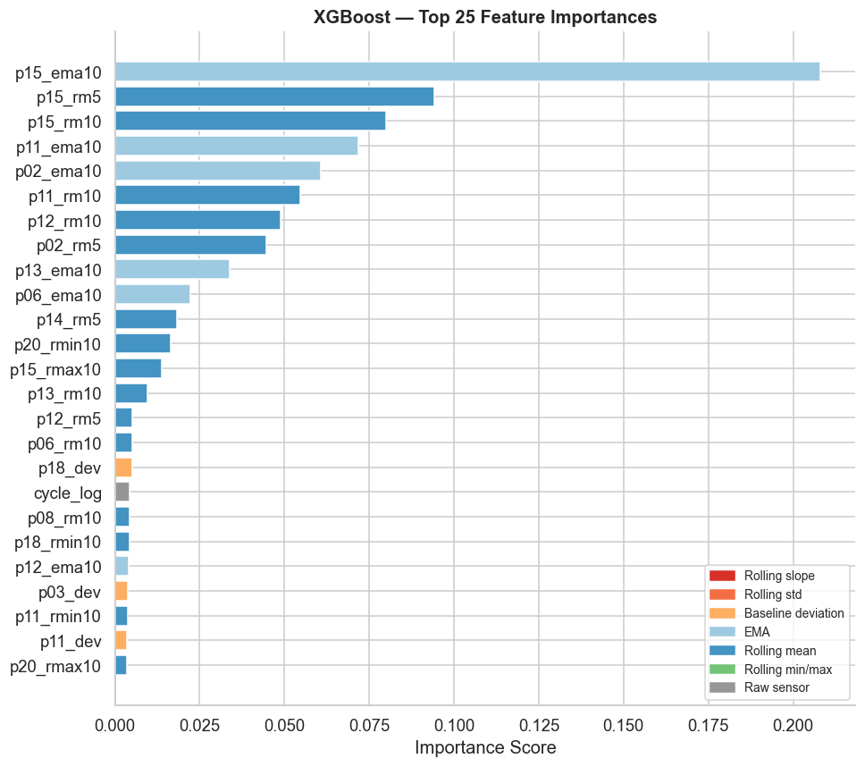
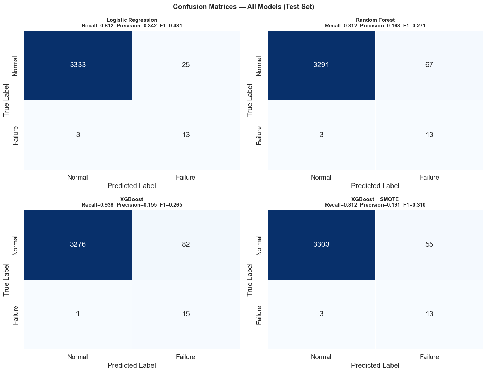

# Motor Failure Prediction


> **Predictive maintenance** — binary classification to detect motor failure one cycle in advance, using multivariate sensor data.

**Author:** Ricardo Neves Junior &nbsp;|&nbsp; [LinkedIn](https://www.linkedin.com/in/ricardo-neves-junior/)

---

## 📓 Start Here

The entire analysis — EDA, feature engineering, model training, evaluation, and conclusions — lives in a single self-contained notebook:

### → [`motor_failure_prediction.ipynb`](motor_failure_prediction.ipynb)

It is **fully executed** with all outputs and visualizations already rendered. You can read it directly on GitHub without running anything.

---

## Problem

Given continuous sensor readings from motors in operation, predict whether a motor will **fail in the next cycle**. The maximum cycle per motor marks the last observation before breakdown — that is the ground truth failure label.

Key challenge: severe class imbalance (80 failures out of 16,138 observations — ratio 1:200), which demands deliberate imbalance handling and recall-focused evaluation.

## Dataset

| | |
|---|---|
| Motors | 80 |
| Observations | 16,138 |
| Features | 21 sensors + 2 settings + id + cycle |
| Failure rate | 0.50% (80 positive samples) |

## Approach

1. **EDA** — sensor variability analysis, Pearson correlation with RUL, degradation trajectory by RUL bucket, temporal trend visualization
2. **Feature Engineering** — 142 features per sample: rolling mean/std/slope/min/max (w=5,10), EMA, deviation from motor-specific baseline
3. **Train/test split** — motor-level group split (64 train / 16 test) to prevent temporal leakage
4. **Models** — Logistic Regression (baseline), Random Forest, XGBoost, XGBoost + SMOTE
5. **Threshold optimization** — precision-recall curve analysis with recall ≥ 0.80 target

## Visualizations

| Sensor Degradation Trajectory | Feature Importance |
|---|---|
|  |  |



## Results

| Model | Threshold | Recall | Precision | F1 | ROC-AUC |
|---|---|---|---|---|---|
| Logistic Regression | 0.934 | 0.812 | 0.342 | 0.481 | 0.9935 |
| Random Forest | 0.077 | 0.812 | 0.163 | 0.271 | 0.9562 |
| **XGBoost** | **0.010** | **0.938** | 0.155 | 0.265 | **0.9893** |
| XGBoost + SMOTE | 0.307 | 0.812 | 0.191 | 0.310 | 0.9892 |

XGBoost with optimized threshold misses **1 out of 16 failures** in the holdout test set (recall = 0.938).

## How to Run

```bash
pip install pandas numpy scikit-learn xgboost imbalanced-learn matplotlib seaborn jupyter
jupyter notebook motor_failure_prediction.ipynb
```

## Repository Structure

```
motor_failure_prediction.ipynb   ← Main notebook — start here
data.csv                         ← Raw sensor dataset
README.md
docs/motor-failure-prediction/   ← Process documentation (exploring, research, planning, implementation)
```
